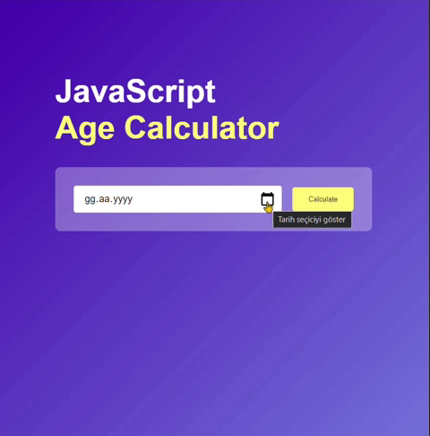

# Age Calculator 🎂

## Overview
The *Age Calculator* is a simple web application designed to calculate a person's age based on their birthdate. Users can input their birthdate, click the **Calculate** button, and the application will display their age in years, months, and days. The application is built using *HTML*, *CSS*, and *JavaScript*.

## Technologies Used 🚀
- **HTML**
- **CSS**
- **JavaScript**

## Usage 💻
1. **Input Birthdate:**
   - Enter your birthdate using the date picker in the input box.
2. **Calculate Age:**
   - Click the *Calculate* button to determine your age.
3. **View Result:**
   - The application will display your age in years, months, and days.

## Installation
No special installation is required for this project. Simply download the project files and open the `index.html` file in a web browser.

## Live Demo 🌐
Live Demo: [Age Calculator](https://age-calculator-kappa-six.vercel.app/)

## Contributing 🤝
Feel free to use, modify, and contribute to the project! If you have any questions or feedback, you can reach me at nisagokdemir@gmail.com

## License
This project is licensed under the **MIT License**.